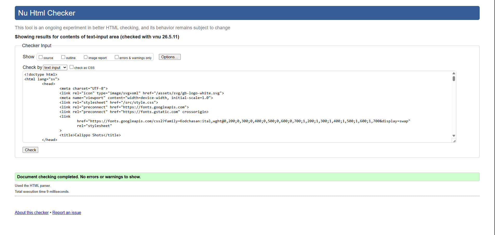
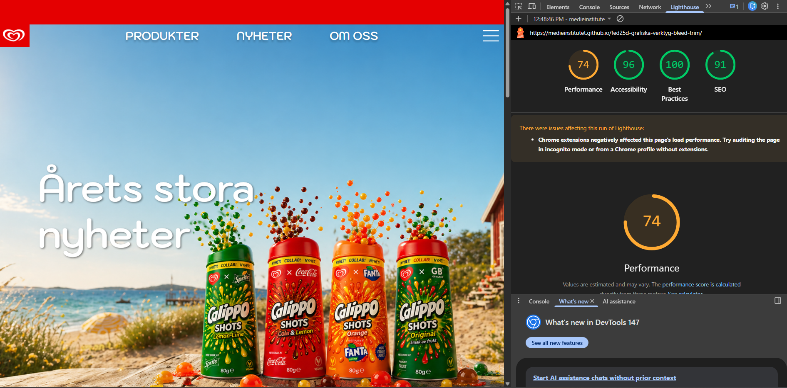
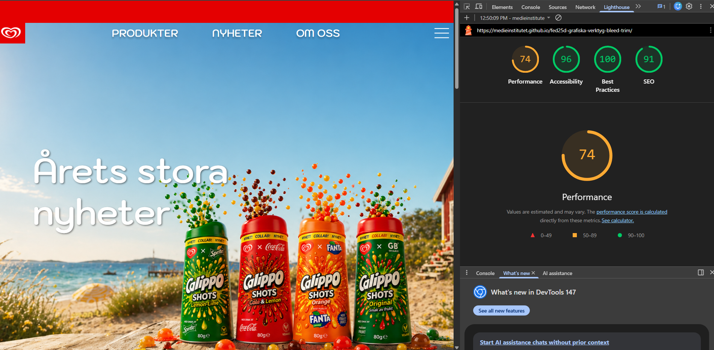

# Calippo Shots Re-launch
## https://medieinstitutet.github.io/fed25d-grafiska-verktyg-bleed-trim/

## About the project

As part of a school project, we designed a **Calippo Shots re-launch website** as a team. The goal was to create a modern, playful and engaging digital experience that reflects the brand's identity. After completing the design, we created a detailed handoff with clear instructions for another group, whose assignment was to code the website.

## Our process

We used our **UX knowledge and agile methods** throughout the design process. We worked with target audience, user experience, structure, content and visual design, developing the concept iteratively based on our research and ideas.

## Design handoff

Once the design was complete, we documented and presented our work before **handing it over to another group for coding**. This gave us experience in creating a structured design handoff for developers.

## What I learned

* UX and user-centered design
* Agile teamwork and collaboration
* Visual and interaction design
* Creating design handoffs for developers

## 📸 Demo / Screenshots

---

## 🛠️ Tech Stack

* HTML
* CSS
* JavaScript
* Biome
* Vite
* JSON
* pnpm

